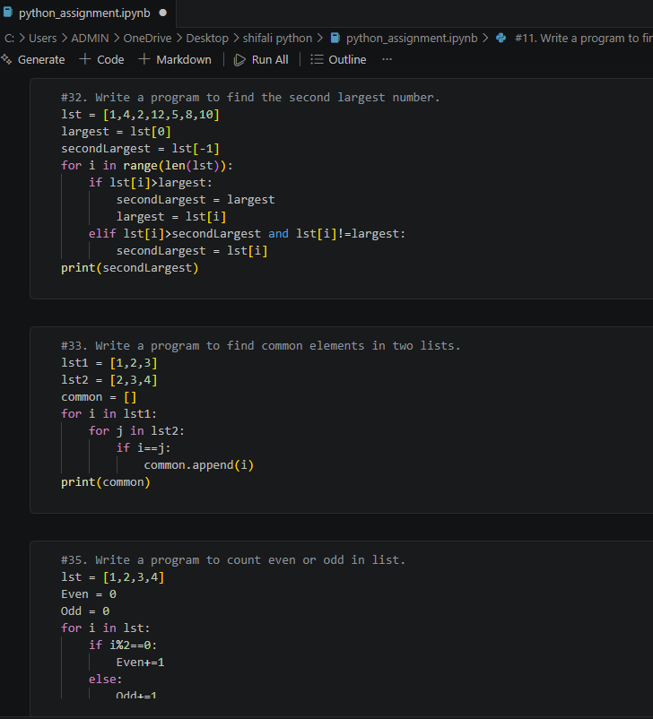

# 🐍 Python Assignment Solutions

A collection of Python assignment solutions covering basic, intermediate, and advanced programming concepts. This repository documents my Python learning journey through practical coding exercises and problem-solving.

## 📚 Topics Covered
- Variables & Data Types
- Conditional Statements
- Loops
- Functions
- Strings
- Lists & Dictionaries
- Recursion
- File Handling
- Exception Handling

## 📂 Repository Contents
- 📄 Python Assignment.pdf — Assignment Questions
- 💻 Python Assignment Solution.ipynb — Solutions

## 🖼️ Preview

## 🛠️ Tech Stack
- Python 3
- VS Code

## 🎯 Purpose
To strengthen my Python fundamentals, improve problem-solving skills, and build a well-organized collection of programming solutions.

---
⭐ If you find this repository helpful, feel free to give it a star!
